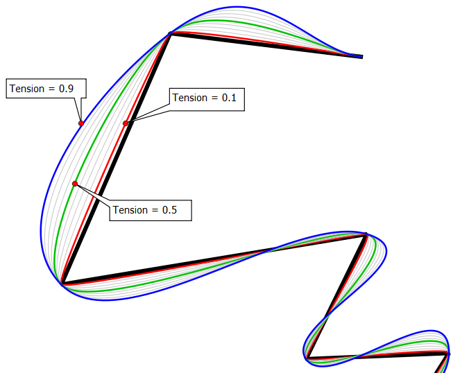

# Spline

Spline is a QGIS plugin for digitizing splines as a chain of straight lines. 
It comes with a Processing algorithm for converting lines into splines. 

A modified [cubic Hermite interpolator](https://en.wikipedia.org/wiki/Cubic_Hermite_spline) is used to obtain a continuous piecewise third-degree polynomials between knots (known spline points).
Each piece is converted to a chain of lines which is then simplified with [Douglas-Peuker algorithm](https://en.wikipedia.org/wiki/Ramer%E2%80%93Douglas%E2%80%93Peucker_algorithm). 

Both, digitizing map tool and the Processing algorithm, have the following parameters:

* **tightness** or **tension** - can be interpreted as the length of the curve tangent at digitized points, must be in interval [0,1]. See picture above.
* **tolerance** for Douglas-Peuker simplification algorithm - the smaller it is, the more segmented is the resulting linestring.
* **maximum number of line segments** - initial number of line segments interpolated between knots - these lines are then simplified.

The algorithm supports `z` and `m` values - they are interpolated *linearly* between knots, if properly defined in input layer.

